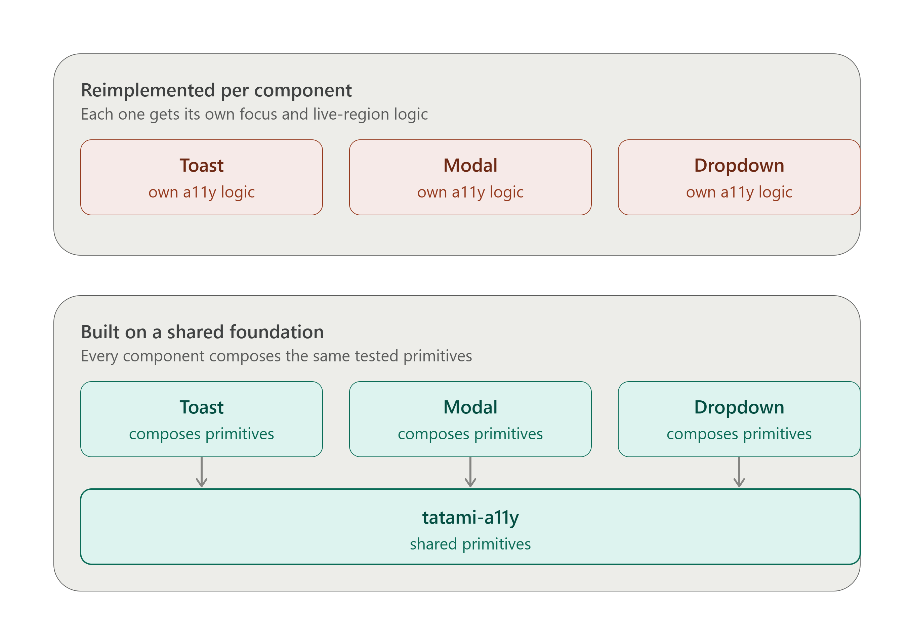

# tatami-a11y

[](https://github.com/chejholloway/tatami-a11y/actions/workflows/ci.yml)
[](https://www.npmjs.com/package/tatami-a11y)
[](https://opensource.org/licenses/MIT)
[](https://github.com/chejholloway/tatami-a11y/actions/workflows/ci.yml)
[-orange)](https://oxc.rs)

Framework-agnostische, barrierefreiheitsorientierte UI-Primitive und Komponenten für Vanilla JavaScript.

**16 Komponenten, 6 gemeinsame Primitive, 746 Unit-Tests, 16 browser-basierte Storybook-Integrationstests mit Barrierefreiheitsprüfungen, keine Laufzeitabhängigkeiten**, die alle die WAI-ARIA-Autorenpraktiken mit verifizierter WCAG 2.2 AA-Konformität implementieren.

## Das Problem

Jede barrierefreie interaktive Komponente benötigt dieselbe aufwändige, leicht falsch zu implementierende Infrastruktur:

- **Live-Regionen:** Ankündigungen für Screenreader, ohne den Fokus zu stehlen
- **Fokuswiederherstellung:** Rückgabe des Fokus, wenn eine transiente Benutzeroberfläche geschlossen wird, selbst wenn das auslösende Element nicht mehr vorhanden ist
- **Fokusfang:** Halten der Tastaturnavigation innerhalb von Modals und Dialogen
- **Reduzierte Bewegung:** Berücksichtigung von Systemeinstellungen ohne manuelle Überprüfungen überall
- **Roving tabindex:** Pfeiltasten-Navigation für Listen, Grids, Bäume und Tablisten
- **HMR-sichere Singletons:** Überleben von Hot Module Reloads, ohne DOM-Knoten zu duplizieren oder Listener zu lecken

Die meisten Projekte bauen dies für jede Komponente von Grund auf neu. Die zehnte Neuimplementierung von "Fokus bei Schließen wiederherstellen" ist genau der Punkt, an dem jemand den Fall vergisst, dass eine Referenz veraltet ist, und ein Dropdown ausliefert, das den Tastaturfokus stillschweigend im `<body>` festhält.

tatami-a11y extrahiert diese gemeinsamen Primitive in eine einzige, getestete Grundlage und baut dann vollständig barrierefreie Komponenten darauf auf. Jede Komponente in der Bibliothek basiert auf denselben bewährten Primitiven, sodass ein in einer Komponente behobener Fehler in allen Komponenten behoben ist.



## Warum "tatami"?

Eine Tatami ist eine traditionelle japanische Bodenmatte, ein standardisiertes, austauschbares Modul, das als Grundlage für einen ganzen Raum dient. Man bemerkt die Tatami nicht, aber alles Stabile ist darauf aufgebaut. Dieselbe Idee hier: Diese Primitive sind die Grundlage, die Komponenten sind der Raum, in dem man tatsächlich lebt.

## Warum Framework-Agnostisch

Radix UI und React Aria lösen dies gut für React. Headless UI deckt Vue und React ab. Wenn man sich nicht in einem dieser Ökosysteme befindet oder eine Vanilla-JS-Codebasis pflegt, gibt es kein ernsthaftes, aktiv gewartetes Äquivalent. tatami-a11y ist genau dafür gebaut: kein virtuelles DOM, keine Framework-Laufzeit, funktioniert identisch, egal ob man es von einer selbstgebauten Komponente, einem Vue Composable, einer Svelte `use:action` oder einem einfachen `<script>`-Tag aufruft.

### Verifizierte Framework-Interoperabilität

Die Behauptung der Framework-Agnostik wurde mit automatisierten Playwright-Tests über drei separate Vite-Gerüste hinweg validiert, wobei jedes `tatami-a11y` aus dem veröffentlichten npm-Paket genau so installierte, wie es ein echter Konsument tun würde. Zwei Komponenten wurden in jedem Framework getestet – Toast (hängt an `document.body` an, außerhalb eines Framework-verwalteten Baums) und Dropdown (fügt Verhalten an einen vom Framework gerenderten DOM-Knoten an). Sowohl das naive Nutzungsmuster als auch ein Framework-idiomatisches, handgebautes Wrapper-Muster wurden getestet, und jedes wurde durch erzwungenes Neu-Rendern des umgebenden Bereichs durch das Host-Framework, während die DOM-Ergänzungen der Bibliothek vorhanden waren, auf die Probe gestellt.

| Framework | Toast (naiv) | Toast (Wrapper) | Dropdown (naiv) | Dropdown (handgemachter Wrapper) |
| --------- | ------------- | --------------- | ---------------- | ------------------------------ |
| **React** | ✅ Bestanden   | ✅ Bestanden    | ✅ Bestanden     | ✅ Bestanden                    |
| **Vue**   | ✅ Bestanden   | ✅ Bestanden    | ✅ Bestanden     | ✅ Bestanden                    |
| **Svelte**| ✅ Bestanden   | ✅ Bestanden    | ✅ Bestanden     | ✅ Bestanden                    |

Alle 12 Tests wurden mit null Klebstoffcode für Toast bestanden. Dropdown funktioniert naiv in allen drei Frameworks und besteht auch mit einem handgemachten, Framework-idiomatischen Wrapper (`useRef`+`useEffect` in React, `ref`+`onMounted`/`onUnmounted` in Vue, `use:action` in Svelte). Vollständige Ergebnisse und Roh-Testausgabe finden Sie in [`framework-interop-check/`](./framework-interop-check/).

**Führen Sie diese selbst aus:** Jedes der Verzeichnisse `framework-interop-check/react-app`, `framework-interop-check/vue-app` und `framework-interop-check/svelte-app` ist eine unabhängige, installierbare Vite-App. Wechseln Sie in eines davon, führen Sie `pnpm install` und `pnpm dev` aus und öffnen Sie die angezeigte lokale URL, um die naiven und Wrapper-Muster-Tests direkt durchzuklicken, anstatt der obigen Tabelle blind zu vertrauen.

> **Hinweis zu `tatami()`:** Die obige Tabelle spiegelt die ursprüngliche Untersuchung mit drei Frameworks wider, die handgefertigte Wrapper verwendete. Der `tatami()`-Adapter wurde anschließend entwickelt und verfügt über dedizierte Unit-Tests, die alle 16 Komponenten abdecken (siehe `__tests__/tatami.test.ts`), einschließlich Tests für Methodenweiterleitung, Zerstörungs-Idempotenz und Entwicklungsmodus-Warnungen. Der `tatami()`-Adapter wurde durch diese Unit-Tests als korrekt funktionierend mit allen 16 Komponenten verifiziert. Ein vollständiger Playwright-Cross-Framework-Harness-Durchlauf steht noch aus, aber die Korrektheit des Adapters ist durch die Unit-Test-Suite erwiesen.

### Astro Islands Demo — vier Frameworks, eine Seite

`framework-interop-check/` beantwortet die Frage, ob tatami-a11y innerhalb jedes Frameworks für sich korrekt funktioniert. `astro-demo/` geht einen Schritt weiter: Es mountet eine React-Insel, eine Vue-Insel, eine Svelte-Insel und einen einfachen JS-Bereich auf derselben Seite mithilfe der Astro-Inselarchitektur und überprüft dann, ob die gemeinsamen Primitive, insbesondere der Live-Region-Ansager, tatsächlich über unabhängig gebündelte Kopien der Bibliothek hinweg koordinieren, anstatt stillschweigend in isolierte Instanzen pro Insel zu duplizieren.

**Live ansehen:** [tatami-a11y-astro.surge.sh](https://tatami-a11y-astro.surge.sh)

**Lokal ausführen:** `cd astro-demo`, `pnpm install`, `pnpm dev`.

### `tatami()` — das Lifecycle-Utility

Die Wrapper-Tests zeigten ein sich wiederholendes Muster: Jedes Framework benötigt dieselben drei Dinge von jeder imperativen DOM-Bibliothek – Initialisierung, sobald das DOM bereit ist, Übergabe von Referenzen auf Framework-verwaltete Elemente und Bereinigung, wenn diese Elemente entfernt werden. Der Boilerplate-Code dafür ist über alle Frameworks hinweg identisch, nur in unterschiedlicher Syntax.

`tatami()` ist ein einziges, Framework-agnostisches Utility, das diesen Handshake für alle 16 Komponenten übernimmt. Es ist keine React-Version der Bibliothek, keine Vue-Version – eine Funktion, keine Framework-Imports, funktioniert überall.

```js
import { tatami } from 'tatami-a11y/adapters/tatami.js';
import { Dropdown, Modal, Accordion } from 'tatami-a11y';

// React — innerhalb von useEffect
const ctrl = tatami(Dropdown, { trigger: triggerRef.current, menu: menuRef.current });
return () => ctrl.destroy();

// Vue — innerhalb von onMounted / onUnmounted
onMounted(() => { ctrl = tatami(Accordion, { container: containerRef.value }); });
onUnmounted(() => ctrl?.destroy());

// Svelte — use: action
export function dropdown(node, { menu }) {
  const ctrl = tatami(Dropdown, { trigger: node, menu });
  return { destroy: () => ctrl.destroy() };
}

// Plain JS, gar kein Framework
const ctrl = tatami(Modal, { trigger: btn, modal: dialog });
openBtn.addEventListener('click', () => ctrl.open());

// Next.js App Router — Client-Komponente erforderlich ('use client' am
// Anfang der Datei), dann dasselbe useEffect-Muster wie in plain React
'use client';
useEffect(() => {
  const ctrl = tatami(Dropdown, { trigger: triggerRef.current, menu: menuRef.current });
  return () => ctrl.destroy();
}, []);

// Nuxt — dasselbe onMounted/onUnmounted-Muster wie Vue, abgesichert mit
// import.meta.client für zusätzliche Sicherheit in Universal-Rendering-Setups
let ctrl;
onMounted(() => {
  if (import.meta.client) {
    ctrl = tatami(Accordion, { container: containerRef.value });
  }
});
onUnmounted(() => ctrl?.destroy());
```

`tatami()` gibt einen Controller mit `destroy()` zurück und leitet jede öffentliche Methode weiter, die die instanziierte Komponente tatsächlich besitzt (zur Laufzeit über Reflexion abgeleitet – keine fest codierte Methodenliste). Im Entwicklungsmodus führt das Aufrufen einer weitergeleiteten Methode nach `destroy()` oder das Aufrufen einer Methode, die die Komponente nicht besitzt, jeweils zu einer `console.warn` mit dem Komponentennamen und dem Methodennamen. Das Framework muss nur zwei Dinge wissen: `tatami()` aufrufen, wenn das DOM bereit ist, und `ctrl.destroy()` zur Bereinigung aufrufen. Alles andere wird von der Komponente selbst gehandhabt.

`Toast` wird als Sonderfall behandelt: Es verwendet eine nur-statische API (`Toast.show()`, `Toast.configure()`, etc.) anstelle von Instanzen, und `tatami()` erkennt dies automatisch und leitet die statischen Methoden direkt weiter.

> **Zu den Next.js- und Nuxt-Beispielen oben:** Dies sind standardmäßige, aktuelle, dokumentierte Lifecycle-Muster für jedes Framework, aber im Gegensatz zu React, Vue und Svelte in der verifizierten Tabelle oben wurden sie nicht durch dieselbe automatisierte Cross-Framework-Harness (eine echte Gerüst-App, erzwungene Neu-Renderings, Playwright) geführt. Betrachten Sie sie als korrekte Anleitung, aber noch nicht als unabhängig gegen diese Bibliothek verifiziert, wie es bei den drei oben genannten Frameworks der Fall war.

### Entwicklungsmodus-Warnungen

Im Entwicklungsmodus gibt `tatami()` `console.warn`-Meldungen aus, wenn eine weitergeleitete Methode nach `destroy()` aufgerufen wird oder wenn ein Methodenname in der Komponente nicht existiert. Diese Warnungen werden durch ein Entwicklungsmodus-Flag gesteuert, das zur Aufrufzeit mit dieser Prioritätsreihenfolge aufgelöst wird:

1. **Manuelle Überschreibung** — `setTatamiDebug(true)` gewinnt immer. Dies ist die richtige Antwort für die Verwendung von `<script>`-Tags ohne Bundler, wo keine automatische Erkennung möglich ist.
2. **`import.meta.env?.DEV`** — funktioniert für Vite-basierte Konsumenten.
3. **`process.env.NODE_ENV !== "production"`** — Fallback für webpack/Node-bewusste Bundler.
4. **Standard `false`** — Stillschweigen standardmäßig in einer nicht erkannten Umgebung.

```js
import { tatami, setTatamiDebug } from 'tatami-a11y/adapters/tatami.js';

// Warnungen während der Entwicklung aktivieren (erforderlich für <script>-Tag-Nutzung)
setTatamiDebug(true);
```

## Schnellstart

```bash
pnpm install tatami-a11y
```

```js
import { announce, pushFocusStack, popFocusStack } from "tatami-a11y";

// Screenreader-Ankündigungen: standardmäßig höflich, nachdrücklich bei Dringlichkeit
announce("Änderungen gespeichert");
announce("Fehler: etwas ist schiefgelaufen", { urgent: true });

// Fokuswiederherstellung für transiente Benutzeroberflächen (Modals, Dropdowns, Dialoge)
pushFocusStack(triggerElement);
// ... Ihr Modal/Dropdown öffnen ...
popFocusStack(); // Fokus kehrt zum triggerElement oder dem nächsten gültigen Fallback zurück
```

## Bereitgestellte Seiten

- **Storybook:** [tatami-a11y-storybook.surge.sh](https://tatami-a11y-storybook.surge.sh), interaktive Komponentenbeispiele mit dem a11y-Addon
- **Dokumentation:** [tatami-a11y-docs.surge.sh](https://tatami-a11y-docs.surge.sh), vollständige API-Dokumentation, generiert von TypeDoc
- **Demo:** [tatami-a11y-demo.surge.sh](https://tatami-a11y-demo.surge.sh), Live-Demo mit allen Komponenten
- **Astro Islands Demo:** [tatami-a11y-astro.surge.sh](https://tatami-a11y-astro.surge.sh), vier Framework-Inseln (React, Vue, Svelte, plain JS) auf einer Seite, über `tatami()` verbunden, demonstriert die Koordination von gemeinsamen Primitiven über unabhängig gebündelte Kopien der Bibliothek

## Was ist enthalten

### Framework-Adapter

| Adapter    | Beschreibung                                                                                                                                              |
| ---------- | --------------------------------------------------------------------------------------------------------------------------------------------------------- |
| `tatami()` | Framework-agnostisches Lifecycle-Utility, das jede Komponente instanziiert, öffentliche Methoden weiterleitet und die Bereinigung übernimmt. Funktioniert mit React `useEffect`, Vue/Nuxt `onMounted`/`onUnmounted`, Svelte `use:action` oder einfachen `<script>`-Tags. |

### Gemeinsame Primitive

| Primitiv                               | Beschreibung                                                                                                                                 |
| -------------------------------------- | -------------------------------------------------------------------------------------------------------------------------------------------- |
| `announce()`                           | Screenreader-Ankündigungen über ARIA-Live-Regionen. Unterstützt höfliches/nachdrückliches Routing, Deduplizierung und korrekte `aria-atomic`-Semantik. |
| `checkReducedMotion()` / `onReducedMotionChange()` | Systemweite Erkennung reduzierter Bewegung mit Änderungs-Listenern. Jede Komponente berücksichtigt dies automatisch.                      |
| `pushFocusStack()` / `popFocusStack()` | Fokuswiederherstellung mit Fallback-Kette für veraltete Referenzen. Wenn das auslösende Element verschwunden ist, geht es zum nächsten fokussierbaren Vorfahren. |
| `activateFocusTrap()` / `deactivateFocusTrap()` | Modales Fokus-Trapping mit Erkennung von Begrenzungen des ersten/letzten Elements und korrektem Tab/Shift+Tab-Zyklus.             |
| `createRovingTabindex()`               | Pfeiltasten-Navigation für Listen, Grids, Bäume und Tablisten. Unterstützt Ausrichtung, Spaltenanzahl, Umbruch und benutzerdefinierte Tastenhandler. |
| `createSingleton()` / `registerCleanup()` | HMR-sichere Singleton-Fabrik. Komponenten überleben Hot Reloads, ohne Listener zu lecken oder DOM-Knoten zu duplizieren.                        |

### Komponenten

| Komponente         | ARIA-Muster                                 | Hauptmerkmale                                                          |
| ------------------ | ------------------------------------------- | ---------------------------------------------------------------------- |
| Akkordeon          | `aria-expanded` / `aria-controls`           | Pfeiltasten-Navigation, Home/End, Live-Region-Ankündigungen            |
| Karussell          | `region` / `group` / `aria-roledescription` | Auto-Wiedergabe, Respekt für reduzierte Bewegung, Folien-Ankündigungen  |
| Combobox           | Combobox + Listbox                          | Tippen zum Filtern, Pfeiltasten-Navigation, aktive Vorfahrtsverwaltung |
| Befehlspalette     | Combobox + Dialog-Modal                     | Globale Tastenkombination Strg+K, Gruppierung, Fokusfang, Live-Region-Zähler |
| Datums-Picker      | Dialog + Grid                               | Volle Tastaturnavigation, Fokusfang, Monatsnavigation                 |
| Dialog             | nicht-modaler Dialog                        | Fokusverwaltung ohne Fangen, Benutzer können heraustabben             |
| Offenlegung        | `aria-expanded` / `aria-controls`           | Einfaches Anzeigen/Ausblenden mit korrekter Semantik                   |
| Dropdown           | Menü + Menüpunkt                            | Fokusfang, Pfeiltasten-Navigation, Escape zum Schließen                |
| Menü-Schaltfläche  | `aria-haspopup="menu"`                      | Menü-Schaltflächenmuster, Fokusverwaltung                              |
| Modal              | Dialog-Modal                                | Fokusfang, Hintergrund, Escape zum Schließen, Fokuswiederherstellung   |
| Mehrfachauswahl-Listbox | Listbox (Mehrfachauswahl)                   | Shift+Klick-Bereich, Strg+Klick-Umschaltung, Typeahead                 |
| Umsortierbare Liste | Liste + `aria-grabbed`                      | Strg+Pfeil zum Umsortieren, Drag-and-Drop, Live-Ankündigungen         |
| Tabs               | Tabliste + Tab + Tabpanel                   | Pfeiltasten-Navigation, Home/End, automatische Tabpanel-Sichtbarkeit  |
| Toast              | Live-Region + `role="alert"`                | Auto-Ausblenden, Alt+T-Sprung-Shortcut, Stapelverwaltung               |
| Tooltip            | `aria-describedby`                          | Hover-/Fokus-Auslöser, Escape zum Schließen, Respekt für reduzierte Bewegung |
| Baumansicht        | Baum + Baumobjekt                           | Erweitern/Zusammenklappen, Pfeiltasten-Navigation, Typeahead, Einzel-/Mehrfachauswahl |

## Konformität

-   **742 Unit-Tests** über 24 Testdateien (jsdom via vitest), alle bestanden
-   **16 Storybook-Integrationstests**, jede Komponente in einem echten Playwright-Browser gerendert und auf interaktives Verhalten überprüft
-   **Integrierte a11y-Checks:** Jede Storybook-Story wird automatisch mit axe-core über `@storybook/addon-a11y` geprüft, inline in der Test-UI angezeigt und im CI blockiert
-   **WCAG 2.2 AA:** keine Verstöße und keine Unvollständigkeiten durch automatisches axe-core-Scanning über alle Storybook-Stories hinweg erkannt (automatisches Scanning deckt eine bedeutungsvolle Teilmenge der WCAG-Kriterien ab, nicht die vollständige Spezifikation; manuelles Screenreader-Testen ist die natürliche nächste Ebene darüber)
-   **WAI-ARIA:** Jede Komponente folgt der relevanten APG-Autorenpraxis
-   **Reduzierte Bewegung:** Jede Animation respektiert `prefers-reduced-motion`
-   **Tastaturnavigation:** Jedes interaktive Element ist vollständig per Tastatur bedienbar
-   **Screenreader:** Jede Zustandsänderung wird über Live-Regionen angekündigt

## Entwicklung

```bash
pnpm install
pnpm run build              # Erstellt nach dist/ (ESM + CJS + Typdeklarationen)
pnpm run dev                # Watch-Modus
pnpm run test               # Führt 742 Unit-Tests aus (vitest, jsdom)
pnpm run test-storybook:run # Führt 16 browser-basierte Integrationstests aus (vitest + Playwright)
pnpm run storybook          # Interaktiver Komponenten-Explorer auf Port 6006
pnpm run lint               # Rust-basierter Linter (oxlint, 50–100× schneller als ESLint)
pnpm run format             # Rust-basierter Formatter (oxfmt, 35× schneller als Prettier)
pnpm run doc                # Erstellt API-Dokumentation
```

### Dev-Toolchain

| Tool        | Stack                                     | Geschwindigkeitsgewinn |
| ----------- | ----------------------------------------- | ---------------------- |
| **Oxlint**  | Rust-basierter Linter (ESLint-kompatibel) | 50–100× schneller      |
| **Oxfmt**   | Rust-basierter Formatter                  | 35× schneller          |
| **Vitest 4.1.10** | Unit- + Storybook-Testrunner              | Nativer Browser-Modus  |
| **Storybook 10.5.5** | Komponententest + a11y-Addon              | Integriert mit Vitest  |
| **Playwright** | Browser-Automatisierung für Integrationstests | Produktionsreif        |
| **Rolldown** _(optional)_ | Zukunftsfähiger Bundler (Vite-Kern)       | Native Rust-Performance |

Insgesamt: **758 automatisierte Tests** (742 Unit- + 16 Storybook), CI läuft in <30s auf Standardhardware.

---

## Bereitstellung

```bash
pnpm run deploy:storybook   # Baut und deployt Storybook nach Surge
pnpm run deploy:docs        # Baut und deployt API-Dokumente nach Surge
pnpm run deploy:astro       # Baut und deployt die astro-demo/ Multi-Framework-Demo nach Surge
```

Das Bereitstellen einer der oben genannten Seiten erfordert ein eigenes [Surge](https://surge.sh)-Konto und eine `.env`-Datei (kopieren Sie `.env.example` und tragen Sie Ihre eigenen Subdomains ein). Die Deploy-Skripte werfen absichtlich einen klaren Fehler, anstatt stillschweigend auf eine echte Subdomain zurückzufallen, sodass das Klonen dieses Repos und das Ausführen eines Deploy-Skripts niemals das Risiko birgt, versehentlich auf die Seite eines anderen zu deployen – Sie deployen immer auf Ihre eigene.

## Browser-Unterstützung

Zielt auf moderne Browser (ES2020) ab: Chrome 80+, Firefox 80+, Safari 14.1+, Edge 80+. Erfordert DOM-APIs.

**Sicher für den Import in einem Server-Side-Rendering-Kontext.** Jeder DOM-Zugriff in `src/components/` und `src/shared/` befindet sich innerhalb eines Funktions- oder Methodenkörpers – nichts liest `document`, `window`, `navigator` oder andere nur-Browser-globale Variablen im Modulumfang, sodass beim Import nichts außer Deklarationen ausgeführt wird. Verifiziert durch das Erstellen des Pakets und den Import jedes Entry Points in einem reinen Node-Prozess ohne DOM-Shims jeglicher Art. CJS (die `.js`-Dateien – dieses Paket hat kein `"type": "module"`-Feld, daher ist `.js` der `require`-Build und `.mjs` der `import`-Build, gemäß der `exports`-Map):

```bash
node -e "require('./dist/index.js')"
node -e "require('./dist/adapters/tatami.js')"
```

Beide sind fehlerfrei. Die ESM-Builds, auf die gleiche Weise:

```bash
node --input-type=module -e "import('./dist/index.mjs')"
node --input-type=module -e "import('./dist/adapters/tatami.mjs')"
```

Beide sind fehlerfrei. Die Codebeispiele der README verwenden die `import`-Syntax, da erwartet wird, dass Verbraucher das Paket so nutzen – die `exports`-Map leitet diese `import`s an den `.mjs`-Build und alle `require()` an den `.js`-Build weiter.

Der Import ist sicher, aber die *Verwendung* der Komponenten erfordert immer noch ein echtes DOM. Das Standard-Lifecycle-Hook-Muster gilt, genau wie in den bereits verifizierten client-only React-, Vue- und Svelte-Integrationen: `useEffect` für React/Next.js, `onMounted` für Vue/Nuxt.

## Lizenz

MIT, siehe LICENSE.