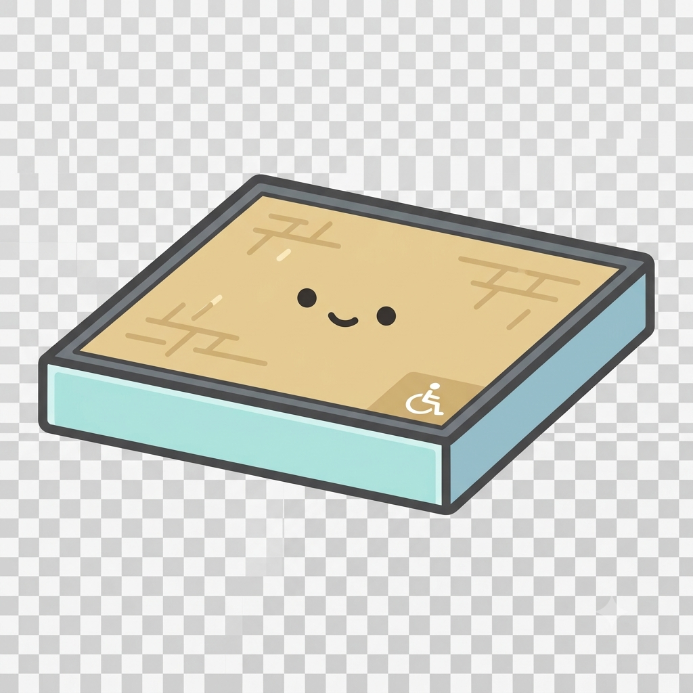

<table>
  <tr>
    <td width="120">
      
    </td>
    <td>
      <h1>tatami-a11y</h1>
    </td>
  </tr>
</table>

[](https://github.com/chejholloway/tatami-a11y/actions/workflows/ci.yml)
[](https://www.npmjs.com/package/tatami-a11y)
[](https://opensource.org/licenses/MIT)
[](https://github.com/chejholloway/tatami-a11y/actions/workflows/ci.yml)
[-orange)](https://oxc.rs)

Primitives et composants d'interface utilisateur axés sur l'accessibilité, agnostiques à tout framework, pour JavaScript pur.

**16 composants, 6 primitives partagées, 746 tests unitaires, 16 tests d'intégration Storybook au niveau du navigateur avec vérifications d'accessibilité, zéro dépendances d'exécution**, tous implémentant les pratiques de création WAI-ARIA avec une conformité WCAG 2.2 AA vérifiée.

## Le Problème

Chaque composant interactif accessible nécessite la même infrastructure, difficile et sujette aux erreurs :

-   **Régions dynamiques (Live regions) :** annoncer aux lecteurs d'écran sans voler le focus
-   **Restauration du focus :** restaurer le focus lorsque l'interface utilisateur transitoire se ferme, même si l'élément déclencheur a disparu
-   **Piège de focus (Focus trapping) :** maintenir la navigation au clavier à l'intérieur des modales et des dialogues
-   **Mouvement réduit :** respecter les préférences système sans vérifications manuelles partout
-   **Tabindex itinérant (Roving tabindex) :** navigation par touches fléchées pour les listes, grilles, arborescences et listes d'onglets
-   **Singletons compatibles HMR :** survivre aux rechargements à chaud des modules sans dupliquer les nœuds DOM ni fuir les écouteurs

La plupart des projets reconstruisent ces éléments de zéro pour chaque composant. La dixième réimplémentation de "restaurer le focus à la fermeture" est précisément l'endroit où quelqu'un oublie le cas de référence obsolète et livre un menu déroulant qui bloque silencieusement le focus du clavier sur `<body>`.

tatami-a11y extrait ces primitives partagées en une fondation unique et testée, puis construit des composants entièrement accessibles par-dessus. Chaque composant de la bibliothèque repose sur les mêmes primitives éprouvées au combat, de sorte qu'un bug corrigé dans l'un est corrigé dans tous.


## Pourquoi "tatami" ?

Un tatami est un tapis de sol japonais traditionnel, un module standardisé et interchangeable qui sert de fondation à une pièce entière. Vous ne remarquez pas le tatami, mais tout ce qui est stable est construit dessus. C'est la même idée ici : ces primitives sont la fondation, les composants sont la pièce dans laquelle vous vivez réellement.

## Pourquoi agnostique au framework ?

Radix UI et React Aria résolvent bien ce problème, pour React. Headless UI couvre Vue et React. Si vous n'êtes pas dans l'un de ces écosystèmes, ou si vous maintenez une base de code vanilla-JS, il n'existe pas d'équivalent sérieux et activement maintenu. tatami-a11y est conçu pour être cela : pas de DOM virtuel, pas de runtime de framework, fonctionne de manière identique que vous l'appeliez depuis un composant fait à la main, un composable Vue, une `use:action` Svelte, ou une simple balise `<script>`.

### Interopérabilité des frameworks vérifiée

L'affirmation d'agnosticisme au framework a été validée par des tests Playwright automatisés sur trois scaffolds Vite distincts, chacun installant `tatami-a11y` à partir du package npm publié, exactement comme le ferait un utilisateur réel. Deux composants ont été testés dans chaque framework — Toast (ajoute à `document.body`, en dehors de tout arbre géré par le framework) et Dropdown (attache un comportement à un nœud DOM rendu par le framework). Le modèle d'utilisation naïf et un modèle de wrapper fait à la main, idiomatique au framework, ont été testés, et chacun a été soumis à des tests de stress en forçant le framework hôte à re-rendre la zone environnante pendant que les ajouts DOM de la bibliothèque étaient présents.

| Framework  | Toast (naïf) | Toast (wrapper) | Dropdown (naïf) | Dropdown (wrapper fait main) |
| ---------- | ------------ | --------------- | --------------- | ---------------------------- |
| **React**  | ✅ Réussi     | ✅ Réussi        | ✅ Réussi        | ✅ Réussi                     |
| **Vue**    | ✅ Réussi     | ✅ Réussi        | ✅ Réussi        | ✅ Réussi                     |
| **Svelte** | ✅ Réussi     | ✅ Réussi        | ✅ Réussi        | ✅ Réussi                     |

Les 12 tests ont réussi sans nécessiter de code d'intégration pour Toast. Dropdown fonctionne de manière naïve dans les trois frameworks et passe également avec un wrapper fait à la main, idiomatique au framework (`useRef`+`useEffect` en React, `ref`+`onMounted`/`onUnmounted` en Vue, `use:action` en Svelte). Les résultats complets et les sorties de test brutes se trouvent dans [`framework-interop-check/`](./framework-interop-check/).

**Exécutez-les vous-même :** chacune des applications `framework-interop-check/react-app`, `framework-interop-check/vue-app` et `framework-interop-check/svelte-app` est une application Vite indépendante et installable. `cd` dans l'une d'entre elles, `pnpm install`, `pnpm dev`, et ouvrez l'URL locale affichée pour parcourir directement les tests naïfs et de wrapper au lieu de vous fier au tableau ci-dessus.

> **Note sur `tatami()` :** Le tableau ci-dessus reflète l'enquête originale sur trois frameworks, qui utilisait des wrappers faits à la main. L'adaptateur `tatami()` a été développé par la suite et dispose de tests unitaires dédiés couvrant les 16 composants (voir `__tests__/tatami.test.ts`), y compris des tests pour le transfert de méthodes, l'idempotence de `destroy`, et les avertissements en mode développement. L'adaptateur `tatami()` a été vérifié comme fonctionnant correctement avec les 16 composants via ces tests unitaires. Un passage complet du harnais Playwright multi-framework est en attente, mais la correction de l'adaptateur est établie par la suite de tests unitaires.

### Démo Astro Islands — quatre frameworks, une page

`framework-interop-check/` répond à la question de savoir si tatami-a11y fonctionne correctement à l'intérieur de chaque framework pris isolément. `astro-demo/` va plus loin : il monte une île React, une île Vue, une île Svelte et une section en JS pur sur la *même page* en utilisant l'architecture des îles d'Astro, puis vérifie si les primitives partagées, en particulier l'annonceur de région dynamique, se coordonnent réellement entre les copies de la bibliothèque regroupées indépendamment plutôt que de se dupliquer silencieusement en instances isolées par île.

**Voir en direct :** [tatami-a11y-astro.surge.sh](https://tatami-a11y-astro.surge.sh)

**Exécuter localement :** `cd astro-demo`, `pnpm install`, `pnpm dev`.

### `tatami()` — l'utilitaire de cycle de vie

Les tests des wrappers ont révélé un schéma récurrent : chaque framework a besoin des mêmes trois choses de toute bibliothèque DOM impérative — s'initialiser une fois que le DOM est prêt, lui fournir des références aux éléments gérés par le framework, et nettoyer lorsque ces éléments disparaissent. Le code standard pour cela est identique d'un framework à l'autre, juste dans une syntaxe différente.

`tatami()` est un utilitaire unique, agnostique au framework, qui gère cet échange pour les 16 composants. Ce n'est pas une version React de la bibliothèque, ni une version Vue — une seule fonction, aucune importation de framework, fonctionne partout.

```js
import { tatami } from 'tatami-a11y/adapters/tatami.js';
import { Dropdown, Modal, Accordion } from 'tatami-a11y';

// React — inside useEffect
const ctrl = tatami(Dropdown, { trigger: triggerRef.current, menu: menuRef.current });
return () => ctrl.destroy();

// Vue — inside onMounted / onUnmounted
onMounted(() => { ctrl = tatami(Accordion, { container: containerRef.value }); });
onUnmounted(() => ctrl?.destroy());

// Svelte — use: action
export function dropdown(node, { menu }) {
  const ctrl = tatami(Dropdown, { trigger: node, menu });
  return { destroy: () => ctrl.destroy() };
}

// Plain JS, no framework at all
const ctrl = tatami(Modal, { trigger: btn, modal: dialog });
openBtn.addEventListener('click', () => ctrl.open());

// Next.js App Router — Client Component required ('use client' at the
// top of the file), then the same useEffect pattern as plain React
'use client';
useEffect(() => {
  const ctrl = tatami(Dropdown, { trigger: triggerRef.current, menu: menuRef.current });
  return () => ctrl.destroy();
}, []);

// Nuxt — same onMounted/onUnmounted pattern as Vue, guarded with
// import.meta.client for extra safety in universal-rendering setups
let ctrl;
onMounted(() => {
  if (import.meta.client) {
    ctrl = tatami(Accordion, { container: containerRef.value });
  }
});
onUnmounted(() => ctrl?.destroy());
```

`tatami()` retourne un contrôleur avec `destroy()` et transmet chaque méthode publique que le composant instancié possède réellement (dérivée à l'exécution via la réflexion — pas de liste de méthodes codée en dur). En mode développement, l'appel d'une méthode transmise après `destroy()` ou l'appel d'une méthode que le composant n'a pas produisent tous deux un `console.warn` avec le nom du composant et le nom de la méthode. Le framework n'a besoin de savoir que deux choses : appeler `tatami()` lorsque le DOM est prêt, appeler `ctrl.destroy()` lors du nettoyage. Tout le reste est géré par le composant lui-même.

`Toast` est traité comme un cas spécial : il utilise une API statique uniquement (`Toast.show()`, `Toast.configure()`, etc.) plutôt que des instances, et `tatami()` le détecte automatiquement et transmet directement les méthodes statiques.

> **Concernant les exemples Next.js et Nuxt ci-dessus :** ce sont des schémas de cycle de vie standard, actuels et documentés pour chaque framework, mais contrairement à React, Vue et Svelte dans le tableau vérifié ci-dessus, ils n'ont pas été soumis au même harnais automatisé inter-framework (une application échafaudée réelle, des re-rendus forcés, Playwright). Traitez-les comme des directives correctes, pas encore comme étant vérifiés indépendamment par rapport à cette bibliothèque de la même manière que les trois frameworks ci-dessus.

### Avertissements en mode développement

En mode développement, `tatami()` émet des messages `console.warn` lorsqu'une méthode transmise est appelée après `destroy()` ou lorsqu'un nom de méthode n'existe pas sur le composant. Ces avertissements sont contrôlés par un drapeau de mode développement résolu au moment de l'appel avec cet ordre de priorité :

1.  **Surcharge manuelle** — `setTatamiDebug(true)` l'emporte toujours. C'est la bonne réponse pour une utilisation de balise `<script>` sans bundler, où aucune détection automatique n'est possible.
2.  **`import.meta.env?.DEV`** — fonctionne pour les consommateurs basés sur Vite.
3.  **`process.env.NODE_ENV !== "production"`** — solution de repli pour les bundlers compatibles webpack/Node.
4.  **Par défaut `false`** — silencieux par défaut dans un environnement non reconnu.

```js
import { tatami, setTatamiDebug } from 'tatami-a11y/adapters/tatami.js';

// Activer les avertissements en mode développement (requis pour l'utilisation de la balise <script>)
setTatamiDebug(true);
```

## Démarrage rapide

```bash
pnpm install tatami-a11y
```

```js
import { announce, pushFocusStack, popFocusStack } from "tatami-a11y";

// Annonces pour lecteur d'écran : polies par défaut, assertives en cas d'urgence
announce("Changements enregistrés");
announce("Erreur : quelque chose s'est mal passé", { urgent: true });

// Restauration du focus pour les interfaces utilisateur transitoires (modales, menus déroulants, dialogues)
pushFocusStack(triggerElement);
// ... ouvrez votre modale/menu déroulant ...
popFocusStack(); // le focus retourne à triggerElement, ou au plus proche élément de repli valide
```

## Sites déployés

-   **Storybook :** [tatami-a11y-storybook.surge.sh](https://tatami-a11y-storybook.surge.sh), exemples de composants interactifs avec l'addon a11y
-   **Documentation :** [tatami-a11y-docs.surge.sh](https://tatami-a11y-docs.surge.sh), documentation API complète générée par TypeDoc
-   **Démo :** [tatami-a11y-demo.surge.sh](https://tatami-a11y-demo.surge.sh), démo en direct avec tous les composants
-   **Démo Astro Islands :** [tatami-a11y-astro.surge.sh](https://tatami-a11y-astro.surge.sh), quatre îles de frameworks (React, Vue, Svelte, JS pur) sur une seule page, connectées via `tatami()`, démontrant la coordination des primitives partagées entre des copies de la bibliothèque regroupées indépendamment

## Ce qui est inclus

### Adaptateur de Framework

| Adaptateur | Description |
| ---------- | ----------- |
| `tatami()` | Utilitaire de cycle de vie agnostique au framework qui instancie n'importe quel composant, transmet les méthodes publiques et gère le nettoyage. Fonctionne depuis `useEffect` de React, `onMounted`/`onUnmounted` de Vue/Nuxt, `use:action` de Svelte, ou de simples balises `<script>`. |

### Primitives partagées

| Primitive                            | Description                                                                                                                                                                        |
| ------------------------------------ | ---------------------------------------------------------------------------------------------------------------------------------------------------------------------------------- |
| `announce()`                         | Annonces pour lecteur d'écran via les régions dynamiques ARIA. Prend en charge le routage poli/assertif, la déduplication et la sémantique `aria-atomic` appropriée.              |
| `checkReducedMotion()` / `onReducedMotionChange()` | Détection de mouvement réduit au niveau du système avec des écouteurs de changement. Chaque composant respecte cela automatiquement.                                              |
| `pushFocusStack()` / `popFocusStack()` | Restauration du focus avec une chaîne de repli en cas de référence obsolète. Si l'élément déclencheur a disparu, il remonte jusqu'à l'ancêtre focalisable le plus proche.         |
| `activateFocusTrap()` / `deactivateFocusTrap()` | Piège de focus modal avec détection des limites du premier/dernier élément et un cycle Tab/Shift+Tab correct.                                                                     |
| `createRovingTabindex()`             | Navigation par touches fléchées pour les listes, grilles, arborescences et listes d'onglets. Prend en charge l'orientation, le nombre de colonnes, l'enroulement (wrapping) et les gestionnaires de touches personnalisés. |
| `createSingleton()` / `registerCleanup()` | Fabrique de singleton compatible HMR. Les composants survivent aux rechargements à chaud sans fuir les écouteurs ni dupliquer les nœuds DOM.                                           |

### Composants

| Composant                 | Motif ARIA                        | Fonctionnalités clés                                                          |
| :------------------------ | :-------------------------------- | :---------------------------------------------------------------------------- |
| Accordion                 | `aria-expanded` / `aria-controls` | Navigation par touches fléchées, touches Home/End, annonces de régions dynamiques |
| Carousel                  | `region` / `group` / `aria-roledescription` | Lecture automatique, respect du mouvement réduit, annonces de diapositives                |
| Combobox                  | combobox + listbox                | Saisie pour filtrer, navigation par touches fléchées, gestion du descendant actif    |
| Palette de commandes      | combobox + dialog-modal           | Raccourci global Ctrl+K, regroupement, piège de focus, décompte de régions dynamiques |
| Sélecteur de date         | dialog + grid                     | Navigation complète au clavier, piège de focus, navigation par mois                |
| Boîte de dialogue         | boîte de dialogue non modale      | Gestion du focus sans piège, les utilisateurs peuvent en sortir par tabulation     |
| Divulgation               | `aria-expanded` / `aria-controls` | Simple affichage/masquage avec une sémantique appropriée                           |
| Menu déroulant            | menu + menuitem                   | Piège de focus, navigation par touches fléchées, Échap pour fermer                     |
| Bouton de menu            | `aria-haspopup="menu"`            | Modèle de bouton de menu, gestion du focus                                    |
| Modale                    | dialog-modal                      | Piège de focus, arrière-plan, Échap pour fermer, restauration du focus              |
| Listbox de sélection multiple | listbox (sélection multiple)      | Sélection de plage Shift+Clic, bascule Ctrl+Clic, saisie prédictive                   |
| Liste réordonnable        | list + `aria-grabbed`             | Réordonnancement Ctrl+Flèche, glisser-déposer, annonces dynamiques                   |
| Onglets                   | tablist + tab + tabpanel          | Navigation par touches fléchées, touches Home/End, visibilité automatique du panneau d'onglets |
| Toast                     | région dynamique + `role="alert"` | Masquage automatique, raccourci Alt+T pour sauter, gestion de la pile                   |
| Infobulle                 | `aria-describedby`                | Déclencheur au survol/focus, Échap pour fermer, respect du mouvement réduit           |
| Arborescence              | tree + treeitem                   | Développer/réduire, navigation par touches fléchées, saisie prédictive, sélection simple/multiple |

## Conformité

-   **742 tests unitaires** répartis sur 24 fichiers de test (jsdom via vitest), tous réussis
-   **16 tests d'intégration Storybook**, chaque composant rendu dans un vrai navigateur Playwright et vérifié pour son comportement interactif
-   **Vérifications d'accessibilité intégrées :** chaque histoire Storybook est automatiquement auditée avec axe-core via `@storybook/addon-a11y`, affichée en ligne dans l'interface utilisateur de test et bloquée en CI
-   **WCAG 2.2 AA :** zéro violations et zéro incomplets détectés par l'analyse automatisée de axe-core sur toutes les histoires Storybook (l'analyse automatisée couvre un sous-ensemble significatif des critères WCAG, pas la spécification complète, les tests manuels avec un lecteur d'écran sont la prochaine couche naturelle par-dessus cela)
-   **WAI-ARIA :** chaque composant suit la pratique de création APG pertinente
-   **Mouvement réduit :** chaque animation respecte `prefers-reduced-motion`
-   **Navigation au clavier :** chaque élément interactif est entièrement utilisable au clavier
-   **Lecteur d'écran :** chaque changement d'état est annoncé via des régions dynamiques

## Développement

```bash
pnpm install
pnpm run build              # Construire dans dist/ (ESM + CJS + déclarations de type)
pnpm run dev                # Mode surveillance
pnpm run test               # Exécuter 742 tests unitaires (vitest, jsdom)
pnpm run test-storybook:run # Exécuter 16 tests d'intégration au niveau du navigateur (vitest + Playwright)
pnpm run storybook          # Explorateur de composants interactif sur le port 6006
pnpm run lint               # Linter basé sur Rust (oxlint, 50 à 100 fois plus rapide qu'ESLint)
pnpm run format             # Formatteur basé sur Rust (oxfmt, 35 fois plus rapide que Prettier)
pnpm run doc                # Construire la documentation API
```

### Chaîne d'outils de développement

| Outil             | Pile                                | Gain de vitesse      |
| :---------------- | :---------------------------------- | :------------------- |
| **Oxlint**        | Linter basé sur Rust (compatible ESLint) | 50 à 100 fois plus rapide |
| **Oxfmt**         | Formatteur basé sur Rust            | 35 fois plus rapide  |
| **Vitest 4.1.10** | Exécuteur de tests unitaires + Storybook | Mode navigateur natif |
| **Storybook 10.5.5** | Tests de composants + addon a11y    | Intégré avec Vitest  |
| **Playwright**    | Automatisation de navigateur pour les tests d'intégration | De qualité production |
| **Rolldown** _(optionnel)_ | Bundler prêt pour l'avenir (noyau Vite) | Performance Rust native |

Total : **758 tests automatisés** (742 unitaires + 16 Storybook), le CI s'exécute en <30s sur du matériel standard.

---

## Déploiement

```bash
pnpm run deploy:storybook   # Construire et déployer Storybook sur Surge
pnpm run deploy:docs        # Construire et déployer la documentation API sur Surge
pnpm run deploy:astro       # Construire et déployer la démo multi-framework astro-demo/ sur Surge
```

Le déploiement de l'un des sites ci-dessus nécessite votre propre compte [Surge](https://surge.sh) et un fichier `.env` (copiez `.env.example` et remplissez vos propres sous-domaines). Les scripts de déploiement jettent intentionnellement une erreur claire plutôt que de revenir silencieusement à un sous-domaine réel, de sorte que le clonage de ce dépôt et l'exécution d'un script de déploiement ne risquent jamais de déployer accidentellement vers le site de quelqu'un d'autre, vous déploierez toujours vers le vôtre.

## Prise en charge des navigateurs

Cible les navigateurs modernes (ES2020) : Chrome 80+, Firefox 80+, Safari 14.1+, Edge 80+. Nécessite les API DOM.

**Peut être importé en toute sécurité dans un contexte de rendu côté serveur.** Chaque accès au DOM dans `src/components/` et `src/shared/` se trouve à l'intérieur d'un corps de fonction ou de méthode — rien ne lit `document`, `window`, `navigator`, ou tout autre global spécifique au navigateur au niveau du module, donc rien ne s'exécute au moment de l'importation au-delà des déclarations. Vérifié en construisant le package et en important chaque point d'entrée dans un processus Node nu sans aucun shim DOM. CJS (les fichiers `.js` — ce package n'a pas de champ `"type": "module"`, donc `.js` est la build `require` et `.mjs` est la build `import`, selon la carte `exports`) :

```bash
node -e "require('./dist/index.js')"
node -e "require('./dist/adapters/tatami.js')"
```

Les deux réussissent sans erreurs. Les builds ESM, de la même manière :

```bash
node --input-type=module -e "import('./dist/index.mjs')"
node --input-type=module -e "import('./dist/adapters/tatami.mjs')"
```

Les deux réussissent sans erreurs. Les exemples de code du README utilisent la syntaxe `import` car c'est ainsi que les consommateurs sont censés utiliser le package — la carte `exports` route ces `import` vers la build `.mjs` et tout `require()` vers la build `.js`.

L'importation est sûre, mais *l'utilisation* des composants nécessite toujours un DOM réel. Le schéma standard des hooks de cycle de vie s'applique, exactement comme dans les intégrations React, Vue et Svelte client-seulement déjà vérifiées : `useEffect` pour React/Next.js, `onMounted` pour Vue/Nuxt.

## Licence

MIT, voir LICENSE.
